# ClinicSense

## Question \#1

* I’d like to add online scheduling to my website. How do I do this?

x

[https://support.clinicsense.com/hc/en-us/articles/115009255708-Step-9-Add-Online-Scheduling-To-Your-Website](https://support.clinicsense.com/hc/en-us/articles/115009255708-Step-9-Add-Online-Scheduling-To-Your-Website)

## Question \#2

* Is there a way to add additional time to clean up after each appointment?

Hello John,

Yes, you can easily add a predefined clean-up time between appointments, by setting an additional time in the Service setup. Let me explain the required steps to do it:

1. On the ClinicSense dashboard, go to the **Setup** tab
2. Select the **Services** option
3. Select the service you would like to add clean-up time to
4. Add the desired additional time \(in minutes\)
5. Click **Save** to confirm the changes

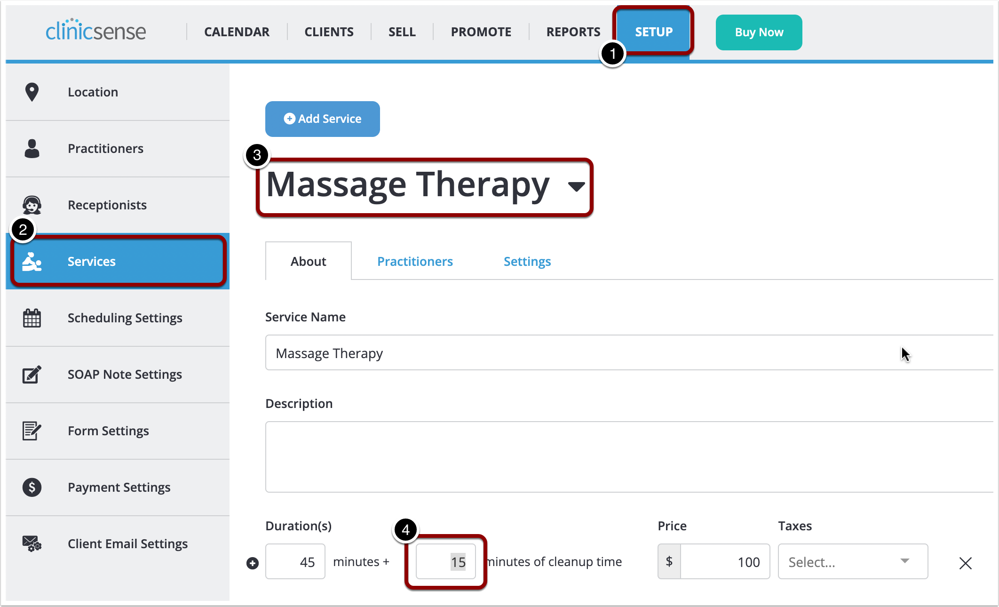

Once you save the changes, any new appointment for that service will have the additional time included. Please let me know if you have further questions.

Best regards,  
Damian

[https://support.clinicsense.com/hc/en-us/articles/115009258788-Add-extra-time-between-appointments](https://support.clinicsense.com/hc/en-us/articles/115009258788-Add-extra-time-between-appointments)

## Question \#3

* Hi! I have a client with two files, how can I combine them?

Hello Joan,

You can easily merge two customer files from the **Clients** menu. Let me show you with an example case, where I merge "Mike Connor" and "Michael Connor":

1. On the dashboard, go to the **Clients** tab
2. Find the client with the duplicate record
3. Select the client file with the most complete data \(in my case, _Michael Connor_ will be used as the master file\)
4. Click on the **Gear button** next to the client's name
5. From the drop-down menu, select Merge client

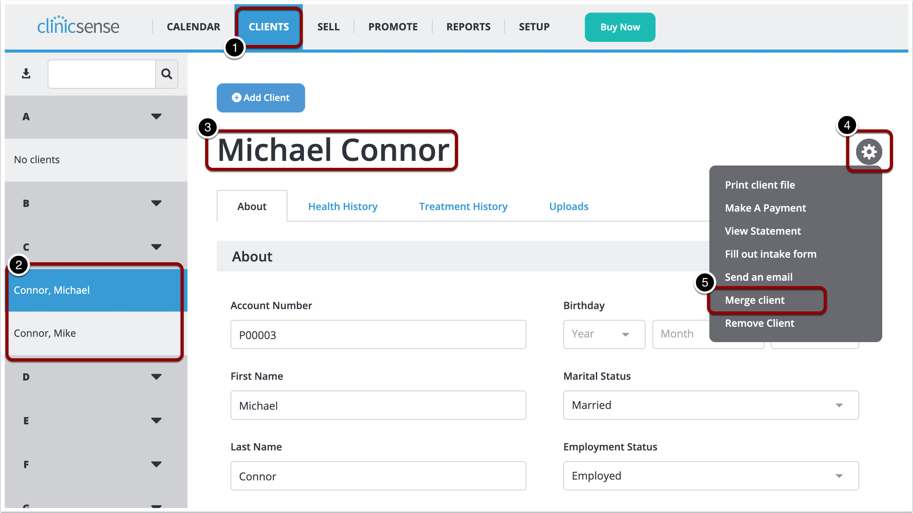

6. On the pop-up window, search for the duplicate client file \(in my case, _Mike Connor_\)  
7. Click on **Preview Merged File**  
8. Review the merged client file, and click on **Merge files** to confirm the changes

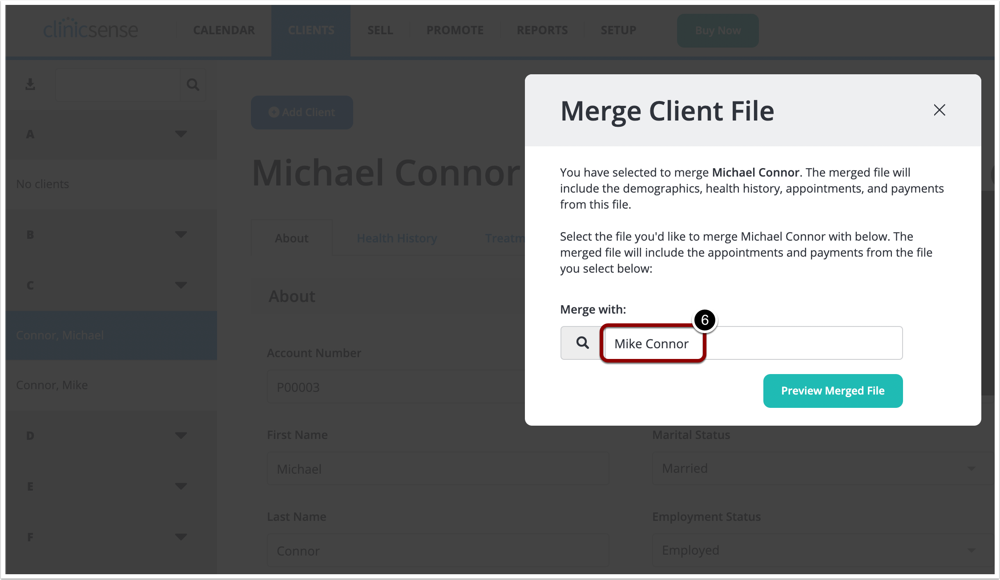

Please note that the merged file will contain the _About_ and _Health History_ information from the client file you selected in Step 3 \(in my example, _Michael Connor_\) and _Appointments_ and _Payments_ from both client files.

Let me know if you have further questions.

Best regards,  
Damian

[https://support.clinicsense.com/hc/en-us/articles/115009265208-Merge-a-duplicate-client-file](https://support.clinicsense.com/hc/en-us/articles/115009265208-Merge-a-duplicate-client-file)

## Question \#4

* I added a new practitioner to my account and I put in the wrong email address for her. Can you fix that on your end or do I fix it somehow?

Hello Peter, thanks for your contact

You can correct the email address for your new practitioner from the **Practitioners** settings, and then just resend the confirmation email so she can set up her account password. Let me guide you with an example:

1. From the dashboard, go to the **Setup** tab
2. Select the **Practitioners** option
3. From the drop-down menu, pick the practitioner you want to edit
4. Click on the **Account** tab
5. Edit the **Account Email**, with the new address
6. Click on **Save** to confirm the changes
7. Finally, click on **Resend Password** to allow the practitioner to set up the password

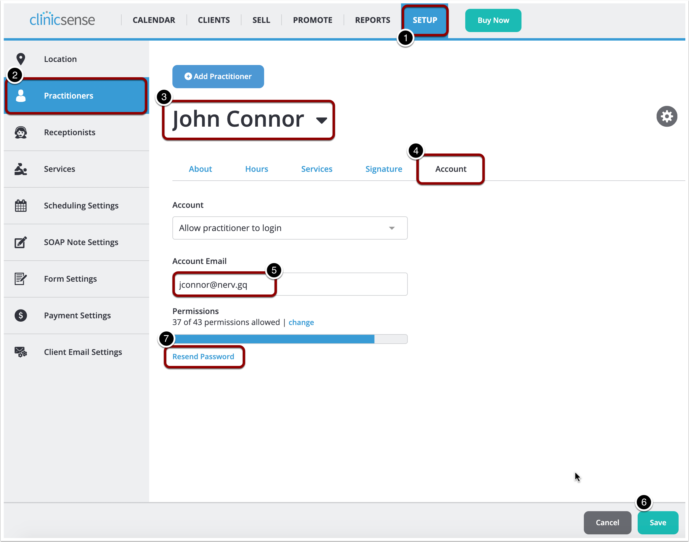

Please let me know if you were able to change the email address or if you need further assistance.

Have a nice day, best regards  
Damian

## Question \#5

* Could you advise if there is a way to set up a receptionist so they do not get emails about appointments? Our clinic director set up her accountant as a receptionist so she could have access to financial/revenue reports but she was getting appointments emails. Thanks in advance.

Hello Michael,

1. Open the drop-down menu, by clicking on your email \(top-right\)
2. Select **My Notifications**

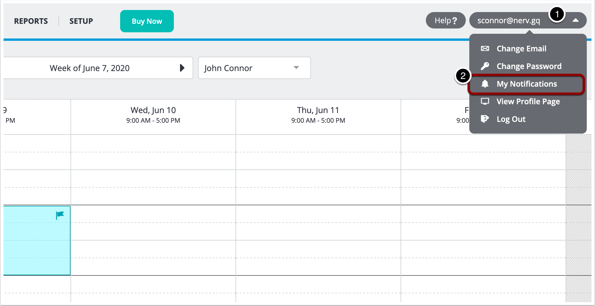

3. De-select the checkboxes to stop receiving appointment notifications  
4. Click on **Save** to confirm the changes

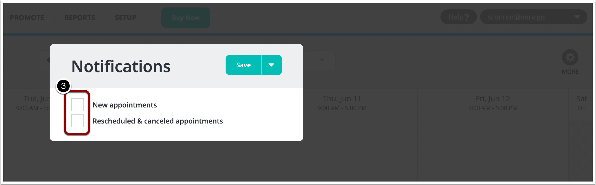

## Question \#6

* I work in a clinic where there are about six of us using ClinicSense. In my settings, I put my services to book online, but the problem is that clients could then start cancelling online. How can I deactivate the cancel online portion?

Hello Claire,

1. Click on the **Setup** tab
2. Select the **Scheduling Settings** option
3. Click on the **Scheduling Rules** tab
4. On the first drop-down box, choose **Never** \(clients can't cancel appointments online\)
5. Click on **Save** to confirm the changes

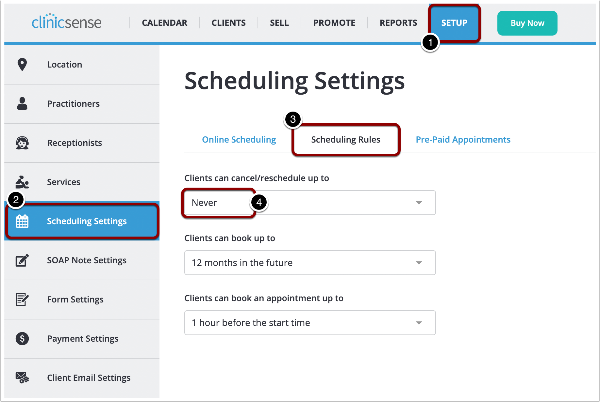

## Question \#7

* Hello, I am trying to figure out how to block practitioners from seeing the financial reports, but I cannot find out how to do it. Please advise.

Hello Jane,

1. On the dashboard, click on the **Setup** tab
2. Select the **Practitioners** option
3. Choose the practitioner you want to edit from the drop-down menu
4. Click on the **Account** tab
5. Click on the **change** link to modify the user permissions

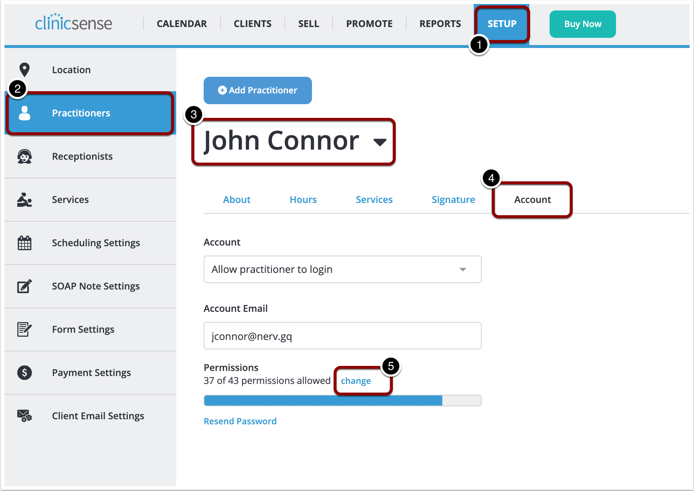

6. On the Permissions screen, change the **Reports** settings as desired

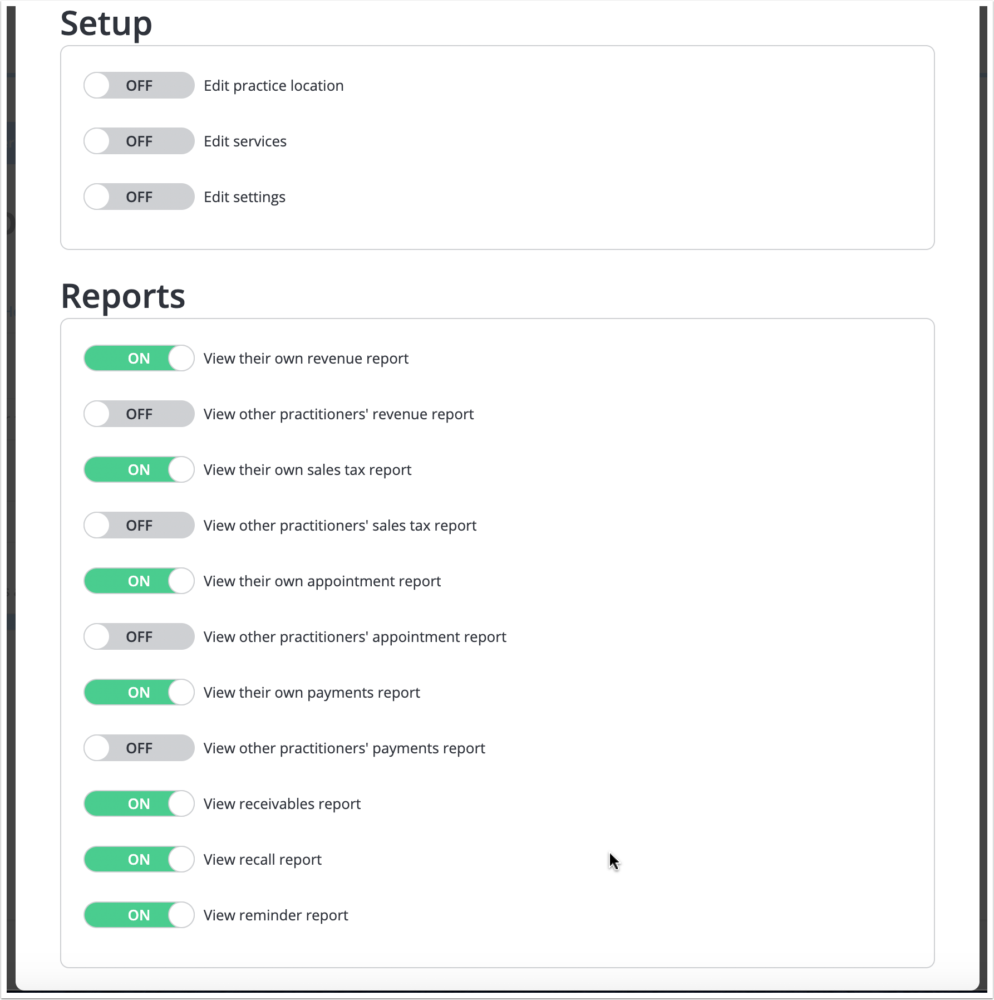

## Question \#8

* Hi, I am no longer able to see new patients because I have too many and not enough time for new ones. Is there a way to not be able to let new people book?

Hello Paul,

1. Click on the **Setup** tab
2. Select the **Scheduling** **Settings** option
3. On the third drop-down box, choose "**Don't allow new clients to book online**"
4. Click on **Save** to confirm the changes

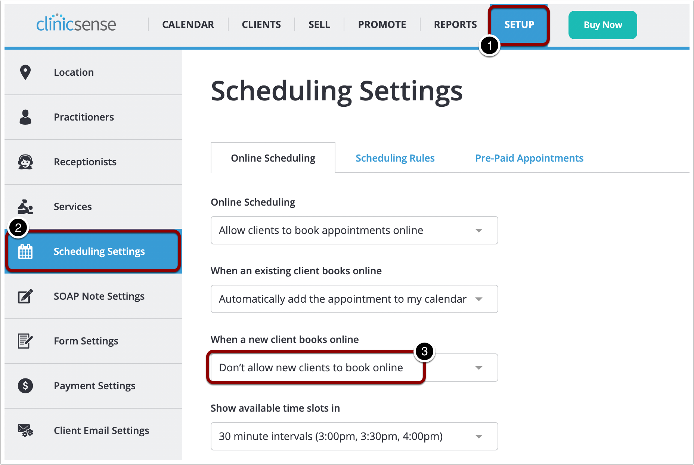

## Question \#9

* When I go to my scheduling settings, my online scheduling is on, yet none of my services can be booked online. Help!

Hello Richard,

1. On the ClinicSense dashboard, click on the **Setup** tab
2. Select the **Services** option
3. Go to the **Settings** tab
4. Verify that the Online Scheduling drop-down box is set to "**This service can be booked online**"
5. Click on **Save** to confirm the changes

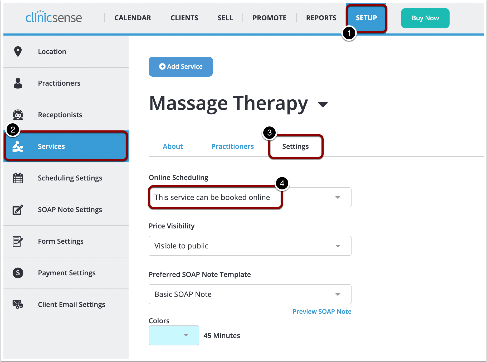

## Question \#10

* I added credit to a client’s account, but now I need to remove it. How do I do that?

Hello Alex,

1. Go to the **Clients** tab
2. Select the desired client
3. Click on the **Gear icon** next to the client's name.
4. On the drop-down menu, select **View** **Statement**

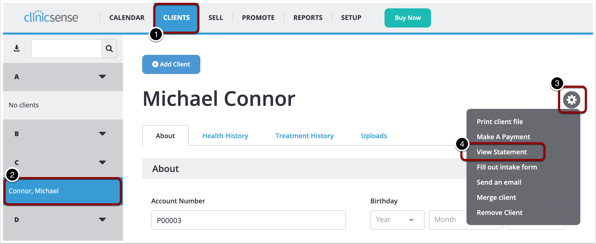

4. On the Statement screen, click on the credit or payment you want to revert

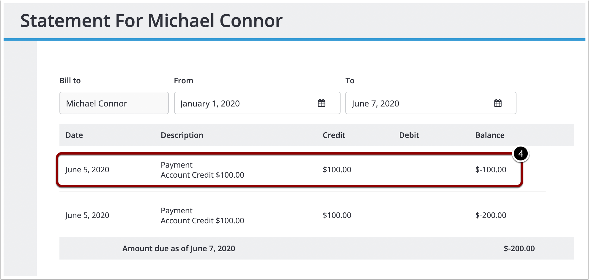

5. On the Payments pop-up, click on the small **gear icon** near the Amount  
6. Select the **Refund payment** option

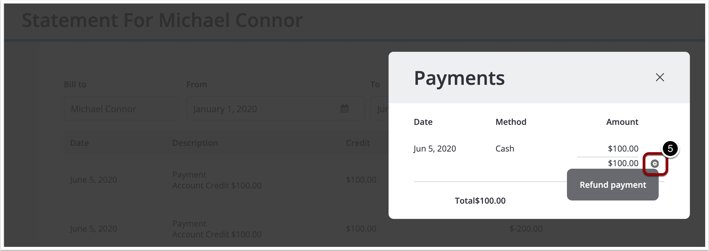

x

[https://support.clinicsense.com/hc/en-us/articles/360014848554-Refund-account-credit](https://support.clinicsense.com/hc/en-us/articles/360014848554-Refund-account-credit)

