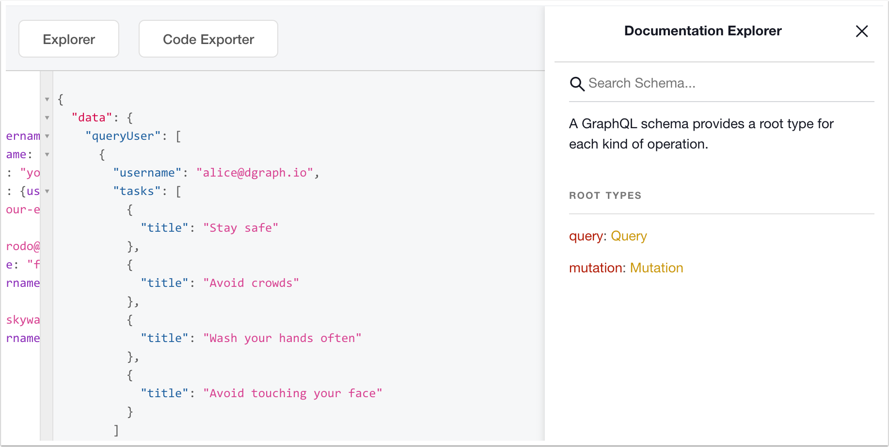
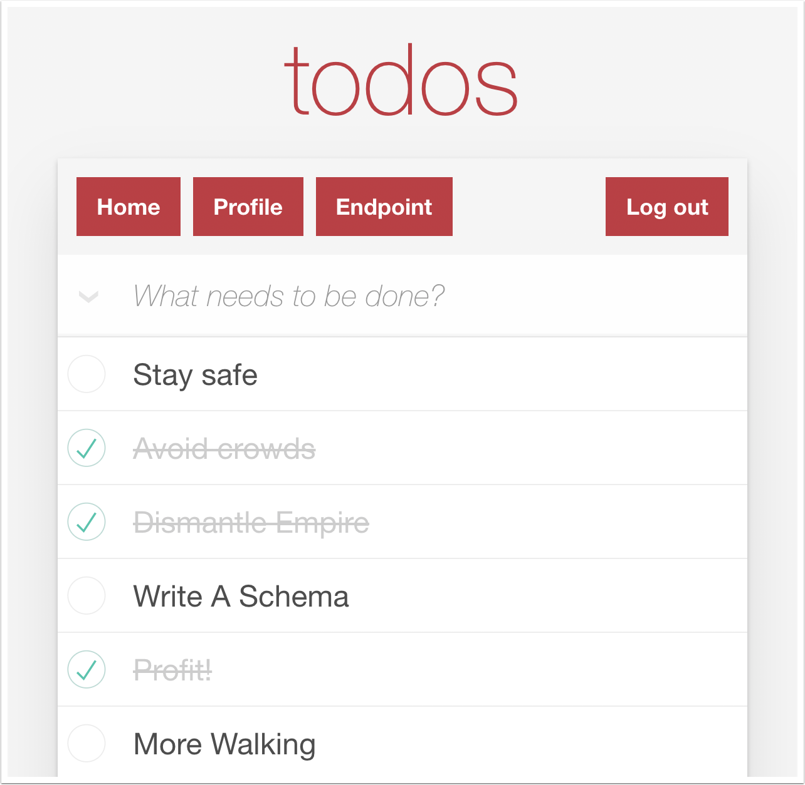

# Slash Quick Start

_These are draft docs for Slash GraphQL, which is currently in beta_

## Introduction

In this guide, we'll build a small distributed App \(DApp\) from the ground up using the [Java client library](https://github.com/radixdlt/radixdlt-java). The techniques you’ll learn in this tutorial are fundamental to make any DApp on [Radix](http://www.radixdlt.com/), and mastering it will give you a better understanding of the Radix distributed ledger.

The guide is divided into several sections:

* **​**[**Basic Setup**]() will give you a starting point to follow the tutorial.
* **​**[**Overview**]() will teach you the fundamentals of Radix's architecture.
* **​**[**Creating an ERC-like Token**]() will show you how to make your first basic DApp.
* **​**[**Beyond the basics**]() will give you additional examples to acquire a deeper understanding of the Java library.

### About our ToDo App

As our example App for this guide, we'll be building a simple ChatBot that receives and replies messages sent to a specific Radix address. With our small ToDo App you'll learn to:

* Create a Slash GraphQL schema
* Apply GraphQL mutations and populate data
* Add Authorization tokens
* Test the app from a React UI

## Z

Welcome to [Slash GraphQL](https://dgraph.io/slash-graphql). By now, you should have created your first deployment, and are looking for a schema to test out. Don't worry, we've got you covered.

This example is for ToDo app that can support multiple users. We just have two types: `Tasks` and `Users`.

## The Schema

The schema itself is pretty simple. It's a standard GraphQL schema, with a few additional directives \(such as `@search`\), which are specific to Slash GraphQL.

Here's a schema that works with Slash GraphQL:

```graphql
type Task {
  id: ID!
  title: String! @search(by: [fulltext])
  completed: Boolean! @search
  user: User!
}

type User {
  username: String! @id @search(by: [hash])
  name: String @search(by: [exact])
  tasks: [Task] @hasInverse(field: user)
}
```

The `Task` type has four fields: `id`, `title`, `completed` and the `user`. The `title` field has the `@search` directive on it, which tells Slash GraphQL that this field can be used in full text search queries.

The `User` type uses the `username` field as an ID, and we will put the email address into that field.

Let's paste that into the [schema tab](https://slash.dgraph.io/_/schema) of Slash GraphQL and hit **Update Schema**. You now have a fully functional GraphQL API that allows you to create, query and modify records of these two types.


That's all, there's nothing else to do. It's there, serving GraphQL --- let's go use it.

## GraphQL Mutations

If you head over to the [API explorer tab](https://slash.dgraph.io/_/explorer), you should see the **Docs** tab, which tells you the queries and mutations that your new database supports.

Let's go ahead and populate some data into this fresh database.



### Populating the database

Lets create a bunch of tasks, for a few of our users:

```graphql
mutation AddTasks {
  addTask(input: [
    {title: "Create a database", completed: false, user: {username: "your-email@example.com"}},
    {title: "Write A Schema", completed: false, user: {username: "your-email@example.com"}},
    {title: "Put Data In", completed: false, user: {username: "your-email@example.com"}},
    {title: "Complete Tasks with UI", completed: false, user: {username: "your-email@example.com"}},
    {title: "Profit!", completed: false, user: {username: "your-email@example.com"}},

    {title: "Walking", completed: false, user: {username: "frodo@dgraph.io"}},
    {title: "More Walking", completed: false, user: {username: "frodo@dgraph.io"}},
    {title: "Discard Jewelery", completed: false, user: {username: "frodo@dgraph.io"}},

    {title: "Meet Dad", completed: false, user: {username: "skywalker@dgraph.io"}},
    {title: "Dismantle Empire", completed: false, user: {username: "skywalker@dgraph.io"}}
  ]) {
    numUids
    task {
      title
      user {
        username
      }
    }
  }
}
```

xx


### Querying the database

Let's also query back the users and their tasks:

```graphql
{
  queryUser {
    username,
    tasks {
      title
    }
  }
}
```

You'll see that Slash figured out that users are unique by their `username`, and so you only see a single record for each user.

```graphql
{
  "data": {
    "queryUser": [
      {
        "username": "skywalker@dgraph.io",
        "tasks": [
          {
            "title": "Dismantle Empire"
          },
          {
            "title": "Meet Dad"
          }
        ]
      },
      {
        "username": "your-email@example.com",
        "tasks": [
          {
            "title": "Write A Schema"
          },
          {
            "title": "Profit!"
          },
          {
            "title": "Create a database"
          },
          {
            "title": "Put Data In"
          },
          {
            "title": "Complete Tasks with UI"
          }
        ]
      },
      {
        "username": "frodo@dgraph.io",
        "tasks": [
          {
            "title": "More Walking"
          },
          {
            "title": "Discard Jewelery"
          },
          {
            "title": "Walking"
          }
        ]
      }
    ]
  },
  "extensions": {
    "touched_uids": 40,
    "tracing": {
      "version": 1,
      "startTime": "2020-08-15T12:59:14.577795285Z",
      "endTime": "2020-08-15T12:59:14.580373297Z",
      "duration": 2578026,
      "execution": {
        "resolvers": [
          {
            "path": [
              "queryUser"
            ],
            "parentType": "Query",
            "fieldName": "queryUser",
            "returnType": "[User]",
            "startOffset": 79480,
            "duration": 2422504,
            "dgraph": [
              {
                "label": "query",
                "startOffset": 125039,
                "duration": 2291416
              }
            ]
          }
        ]
      }
    },
    "queryCost": 1
  }
}
```

## Authorization

Now that we have a schema working, let's update that schema to add some authorization. We'll update the schema so that users can only read their own tasks back.

```graphql
type Task @auth(
  query: { rule: """
    query($USER: String!) {
      queryTask {
        user(filter: { username: { eq: $USER } }) {
          __typename
        }
      }
    }"""}), {
  id: ID!
  title: String! @search(by: [fulltext])
  completed: Boolean! @search
  user: User!
}

type User {
  username: String! @id @search(by: [hash])
  name: String @search(by: [exact])
  tasks: [Task] @hasInverse(field: user)
}


# Dgraph.Authorization X-Auth-Token https://dgraph.io/jwt/claims RS256 "-----BEGIN PUBLIC KEY-----\nMIIBIjANBgkqhkiG9w0BAQEFAAOCAQ8AMIIBCgKCAQEAp/qw/KXH23bpOuhXzsDp\ndo9bGNqjd/OkH2LkCT0PKFx5i/lmvFXdd04fhJD0Z0K3pUe7xHcRn1pIbZWlhwOR\n7siaCh9L729OQjnrxU/aPOKwsD19YmLWwTeVpE7vhDejhnRaJ7Pz8GImX/z/Xo50\nPFSYdX28Fb3kssfo+cMBz2+7h1prKeLZyDk30ItK9MMj9S5y+UKHDwfLV/ZHSd8m\nVVEYRXUNNzLsxD2XaEC5ym2gCjEP1QTgago0iw3Bm2rNAMBePgo4OMgYjH9wOOuS\nVnyvHhZdwiZAd1XtJSehORzpErgDuV2ym3mw1G9mrDXDzX9vr5l5CuBc3BjnvcFC\nFwIDAQAB\n-----END PUBLIC KEY-----"
```

Slash GraphQL allows you to pass JWT with custom claims as a header, and will apply rules to control who can query or modify the data in your database. The `@auth` directive controls how these rules are applied, as filters that are generated from the JWT token.

In our schema, we specify that one can only query tasks if the tasks's user has a username that matches `$USER`, a field in the JWT token.

The Authorization magic comment specifies the header the JWT comes from, the domain, and the key that's signed it. In this example, the key is tied to our dev Auth0 account.

More information on how this works in [the documentation](https://graphql.dgraph.io/docs/authrorization/).

Let's try querying back the tasks:

```graphql
{
  queryTask {
    title
  }
}
```

We should be getting empty results here, since you no longer have access.

## Testing it out with a Simple UI

We've built a ToDo app with [React](https://reactjs.org/) that you can use to close these ToDos off. Le t's head over to our sample React app, deployed at [https://relaxed-brahmagupta-f8020f.netlify.app/](https://relaxed-brahmagupta-f8020f.netlify.app/).

You can try creating an account with your email, or logging in with `frodo@dgraph.io` / `skywalker@dgraph.io`. Like the first Death Star, Luke wasn't big on security, his password is `password`. Frodo has the same password.



