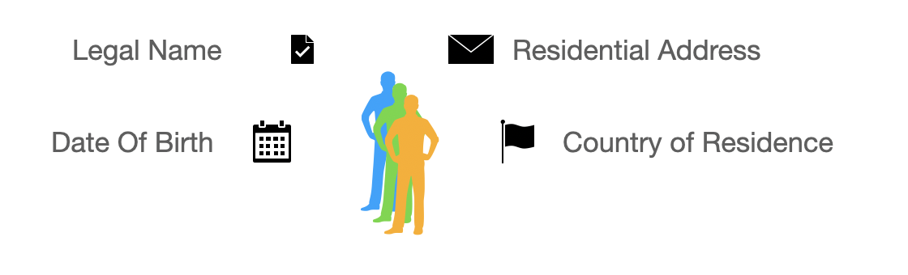
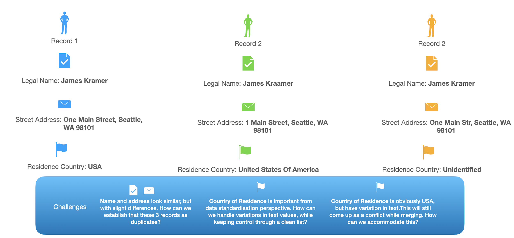
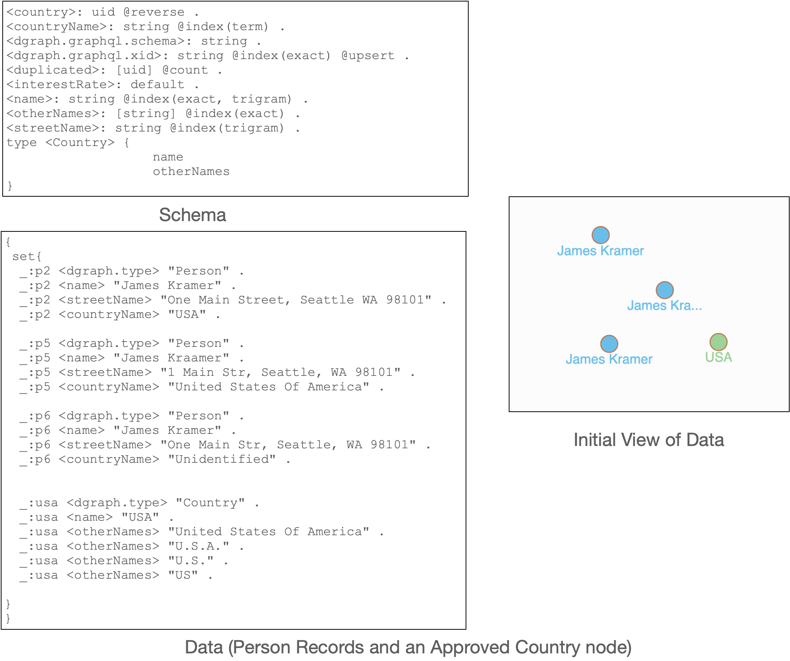
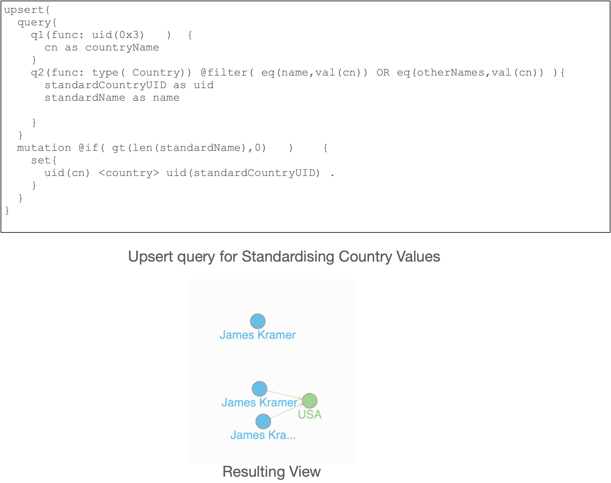
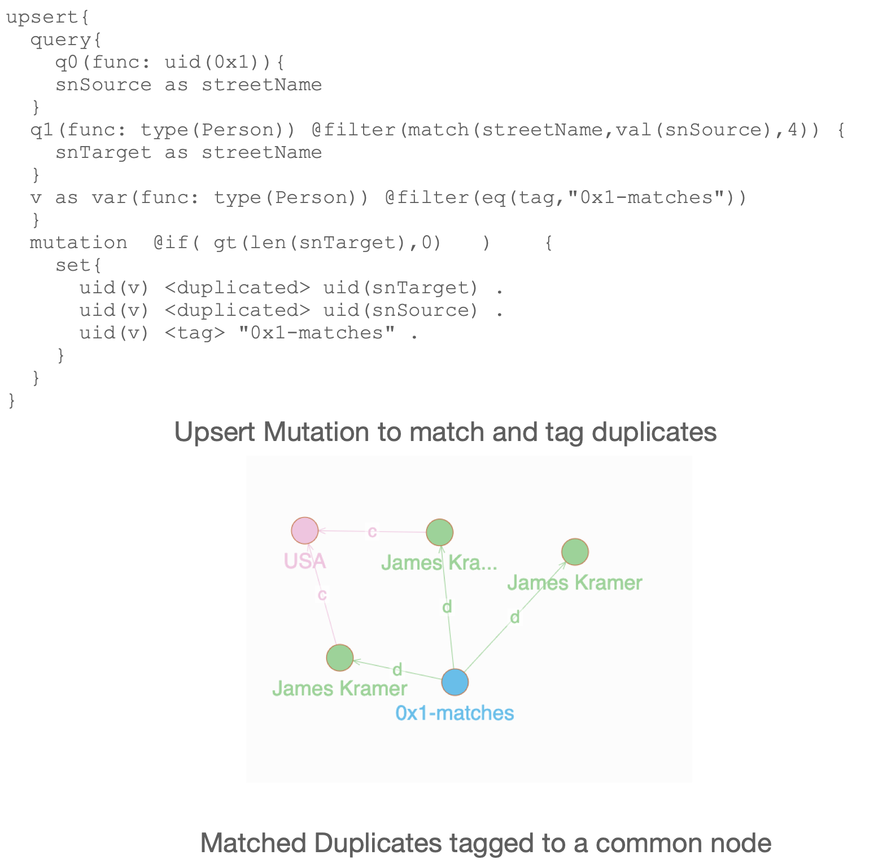
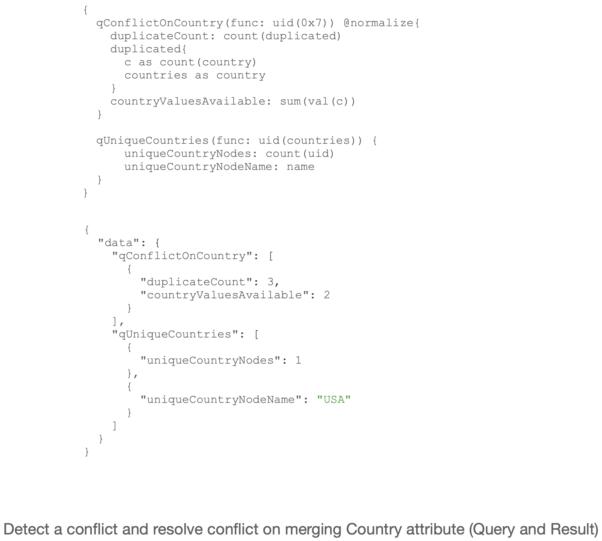

# Untitled

**Using Dgraph For Entity Resolution**

**An Introduction**

Anand Chandrashekar

## What is Entity Resolution?

* For many businesses, it is important to uniquely identify its customers and partners. This unique identification is the basis on which several business policies are applied. For example, maximum discount, one-time offers, and maximum claim amounts, etc., need to have a trusted customer/partner database that doesn’t allow duplicates.
* Entity Resolution is the process of comparing key attributes of customer or partner records to identify if they represent the same or completely different entities. For example, you can often uniquely identify a business partner by the registered name and address. A living person is identified with their full name, date of birth, gender, and address.
* Poor Entity Resolution practices result in gaps in processes that lead to inefficiencies and mistakes, that can often be exploited by malicious actors. Frauds frequently occur by slightly changing customer attributes and claiming inappropriate benefits. For example, there are instances in the health insurance industry of claiming benefits for 3-4 limbs by submitting spurious, duplicate claims.

### What are the Business Processes involved

<table>
  <thead>
    <tr>
      <th style="text-align:left"><b>#</b>
      </th>
      <th style="text-align:left">Business Process</th>
      <th style="text-align:left">Description</th>
    </tr>
  </thead>
  <tbody>
    <tr>
      <td style="text-align:left">1</td>
      <td style="text-align:left">Data Standardization</td>
      <td style="text-align:left">
        
Data Standardisation involves tight control of the values associated with
          certain attributes. For example, we may want a clean reference list of
          countries, state names, city names, etc., as opposed to a free-flow entry
          of these attributes. This ensures that the information stored is not ambiguous.
          For example, we may apply a policy that any customer data that does not
          contain a city name that maps to the clean reference list is rejected.
          This forces usage of a higher quality of data, which in turn results in
          higher confidence of data stored in the database.

        
In the process of data standardization, we try to match the existing value
          of an attribute to a clean list. When a suitable match is found, we &#x201C;hook&#x201D;
          or connect the attribute to this clean list, and thus make it available
          for any subsequent processes.

      </td>
    </tr>
    <tr>
      <td style="text-align:left">2</td>
      <td style="text-align:left">Duplicate Detection</td>
      <td style="text-align:left">
        
This next process is critical in uniquely identifying an entity. In distributed
          systems, there is often a lack of a single unique &#x201C;ID&#x201D; attribute
          that can disambiguate and uniquely identify an entity. Thus, every entity
          needs to be frequently compared with other entities in the system to establish
          uniqueness. In other words, if the attributes of an entity are not the
          same as any other entity within the current system, we can declare it as
          unique, at least in that particular system.

        
We can pick which attributes are critical in the makeup of an entity.
          A name and address are important for a person or organization, while a
          text description is critical for products.

        
Due to human error or any other unavoidable circumstance, there may be
          slight variations in spelling in a name or address. Hence, we often cannot
          match the attributes by complete equality. This is why the duplicate detection
          mechanism often takes a more flexible approach to achieve matches. These
          include fuzzy text matching, and probability-based duplicate detection
          approaches, etc.

      </td>
    </tr>
    <tr>
      <td style="text-align:left">3</td>
      <td style="text-align:left">Data Merging</td>
      <td style="text-align:left">
        
Once we have found duplicates, we will end up with the same values for
          attributes across these duplicates, or different, and in some cases, not
          universally available. It&#x2019;s often not straightforward to understand
          how to resolve multiple values of the same data into a single golden copy.
          For example, the last updated timestamp may prove the deciding factor in
          the case of mobile numbers, while an insured address may be preferable
          as a residence address.

        
The process of data merging is all about detecting potential conflicts
          in identifying a unique golden value for a given attribute, determining
          the right mechanism (last updated, source of the attribute, etc.) to break
          the deadlock, and finally, saving this value for the attribute.

      </td>
    </tr>
  </tbody>
</table>

### An Example: Three records for James Kramer

### A simplified example: Schema and Initial Data Load

Let us now demonstrate how Dgraph can help with a simple scenario.

* A schema containing name, address \(streetName\) and a country name for a Person is provided.
* The schema also accommodates a type “Country” which will store country names as per ISO code with allowed aliases \(“otherNames”\).
* Three records representing duplicate Person records as per the scenario discussed is created.
* “USA” is created as a valid 3-character abbreviation for type “Country” as well as allowed aliases.

Please note that these nodes are distinct and no relationship between them has been asserted.

## Standardization: Match country names to ISO code and known aliases, and connect them

As a first step, we want to link the country attribute \(“countryName”\) of the Person records with the corresponding “Country” node.

* The “upsert” query attached is run for each Person entity by passing in its uid. The countryName attribute is compared with either the 3-character ISO code \(“name”\) or any of the allowed aliases \(“otherNames”\).
* An existing match of type “Country” is confirmed by the @if check.
* If a “Country” node exists, the Person nodes are linked.
* We can query the Person nodes again, and this time we find that two of the nodes which had the appropriate ISO code or an approved alias are now connected to the corresponding country node. In other words, we can say that the country value of the Person is now as per standards.

This standardization will prove beneficial for several other business processes down the line. There will be no need to remember ad-hoc representations of country names, and all querying can be driven off these standards-based Country nodes.

## Duplicate Detection and Tagging: Fuzzy Match on Street names

* Duplicates are detected based on the values of certain attributes. For Persons and Organisations, this is often a name and address. In this demonstration, we are matching on street names. The uid “0x1” points to one of the Person nodes. This node is matched on “name” and “streetName” attributes with other Person nodes in the system.
* To allow for minor error or noise in the data, a fuzzy text match function provided by Dgraph is used. The “Match” function checks for street name similarities within a tolerance of 4 characters. We also do a similar check for the “name” attribute with a tolerance of 2 characters.
* If at least one match is found, the matched node is hooked into a common parent node. As a result, all matches will be hooked up to a common parent, with a “duplicated” edge leading to the matched nodes.
* We have now achieved detection and tagging of duplicates

## De-duplication: Conflict Detection and Merging

With duplicates now tagged, we can then move on to the task of merging attribute values into a single golden record. This task involves selecting a particular value for each attribute from the duplicates and nominating it as the final golden attribute value. This set of golden attributes is often called a golden record and will be used in all downstream business processes, such as spend analytics, fraud detection, reporting, and so on. The uid “0x7” is the parent node of tagged duplicates for the Person “James Kramer”.

The task of merging can be simple or complex depending on the attribute involved. In our case, selecting a street name may be as simple as picking the first one amongst the duplicates. This is because the street name was used as an attribute for detecting duplicates.

However, this is not the case for the country attribute. Please recall that while two of the records had a clean country node attached, one of them had none. You can see this by running the query “qConflictOnCountry”\). Out of three duplicate nodes, only two nodes have valid country data available

In this case, we may apply a business rule that states: “If the valid countries available in the duplicate converge to any one single value, we will pick this value as a golden record”. This business rule is translated into the query “qUniqueCountries”. We can see that indeed there is one unique country node and the value is “USA”. This can now be used as the final golden value for the “Country” attribute of the person.

